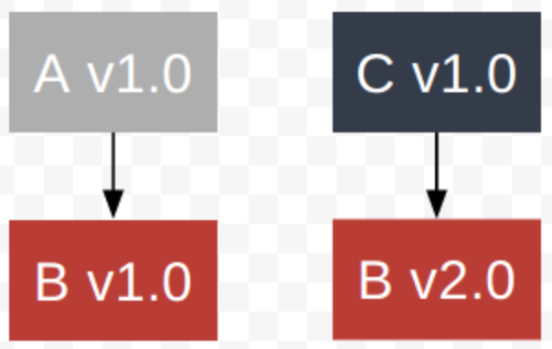
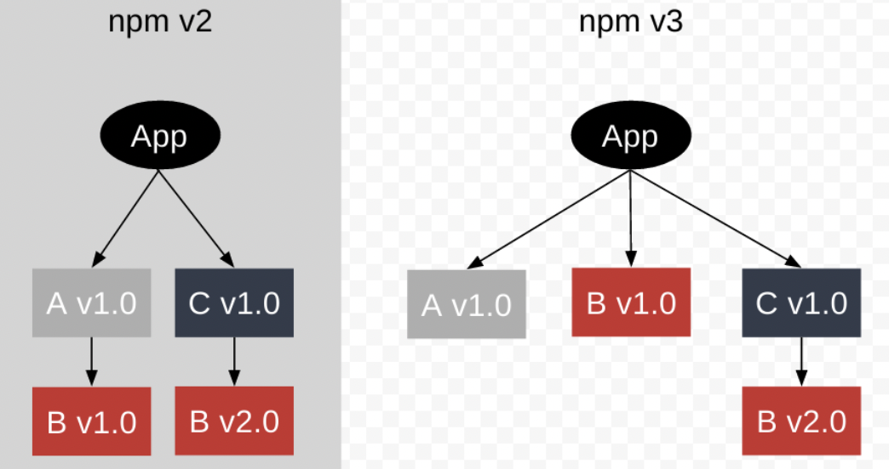

# 패키지매니저

## 📌 서론

### 📚 하는 것들

- 메타데이터 처리 및 쓰기 (package.json)
- 스크립트 관리 (사용자 지정 스크립트)
- 보안 검사
- 의존성 관리 (node_modules)
  - NPM에 올라온 노드 모듈들(패키지)들이 있으며,  
    해당 패키지들 서로서로 의존관계를 가질 수 있다.  
    만약 A패키지와 B패키지 둘 다,  
    C패키지에 의존하고 있다면 어떻게 관리해야할까  
    

## 📌 NPM

- 가장 기본적인 Node Package Module
- NPM V2 와 V3 가 패키지의 의존성 문제를 해결하는 방법은 달라
  
  - NPM2 에서는 의존 관계에 있는 모듈을 해당 모듈 아래에 둠
    - 이 경우, 동일한 패키지에 대한 여러 중복 폴더가 생겨버릴 수 있음
  - NPM3 에서는 모든 모듈을 Flat 하게 두지만 (호이스팅), 
    특정 모듈에서 이미 설치된 모듈과 다른 버전이 필요하면, 
    그 모듈 아래에 둠 
    ⇒ 해당 방식에서는 “내컴되, 니컴안 “ 현상이 발생할 수 있음 (에러 찾기 어려움) 
    ⇒ 모듈을 설치하는 순서에 따라, 의존성 구조가 달라지는 문제가 생김

## 📌 YARN Classic

## 📌 PNPM

## 📌 YARN BERRY

## 📌 참고자료

- [패키지-매니저-그것이-궁금하다](https://medium.com/zigbang/%ED%8C%A8%ED%82%A4%EC%A7%80-%EB%A7%A4%EB%8B%88%EC%A0%80-%EA%B7%B8%EA%B2%83%EC%9D%B4-%EA%B6%81%EA%B8%88%ED%95%98%EB%8B%A4-5bacc65fb05d)
- [pnpm-a-manager-what-is-not-flat](https://imch.dev/posts/pnpm-a-manager-what-is-not-flat/)
- [fe-package-mono-with-storybook](https://github.com/itjustbong/fe-package-mono-with-storybook)

